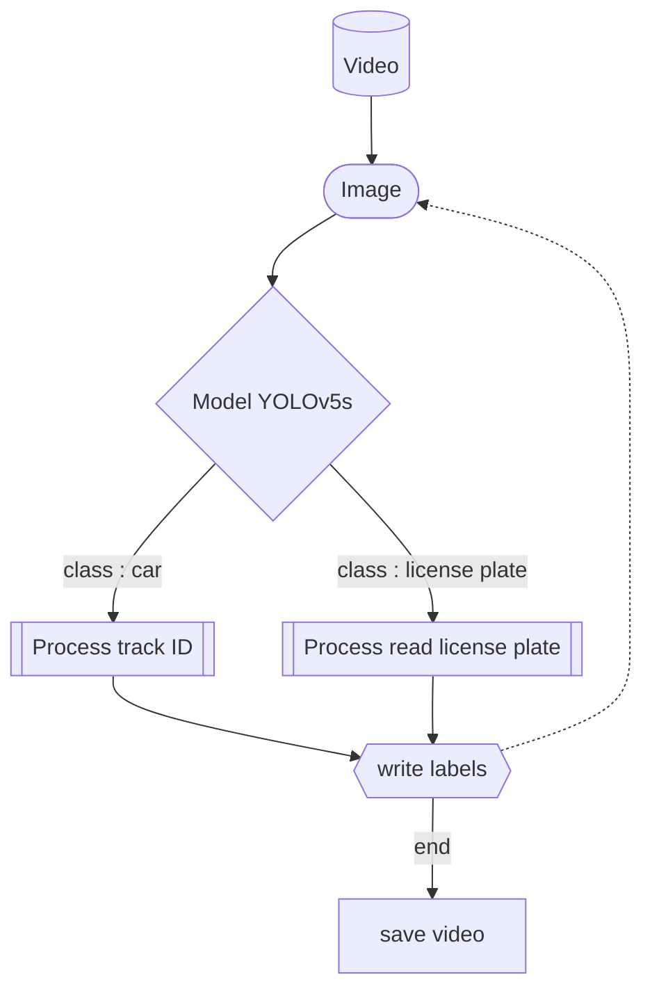

# Test

Create a vehicle detection application and associated French license plate recognition, based on a video provided.
Implement a complete pipeline that takes the supplied video as input, applies vehicle and plate detection, recognizes characters, and generates the same annotated video as output, with for each detected vehicle:

- a unique identifier (track_id)
- the recognized license plate number
- the detection confidence coefficient

